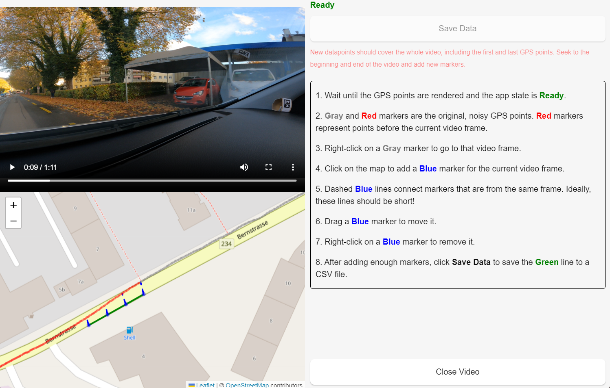

# TrajApp

A Tauri-React desktop app to manually re-label the noisy GPS data in GoPro videos.

The GoPro GPS data is often noisy and inaccurate. This app allows you to manually re-label the GPS data by clicking on the map and dragging the points around, with the relevant video frame visible. The app will then interpolate the GPS data between the points you clicked on.



## Development

```bash
npm run tauri dev
```

## Build

```bash
npm run tauri build
```
